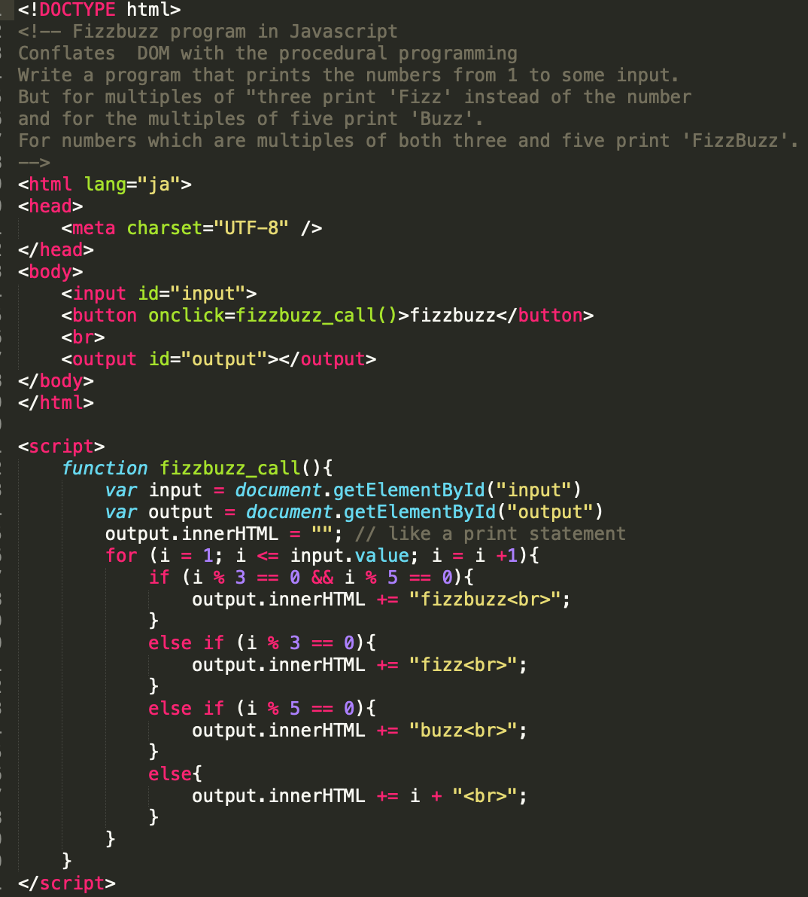
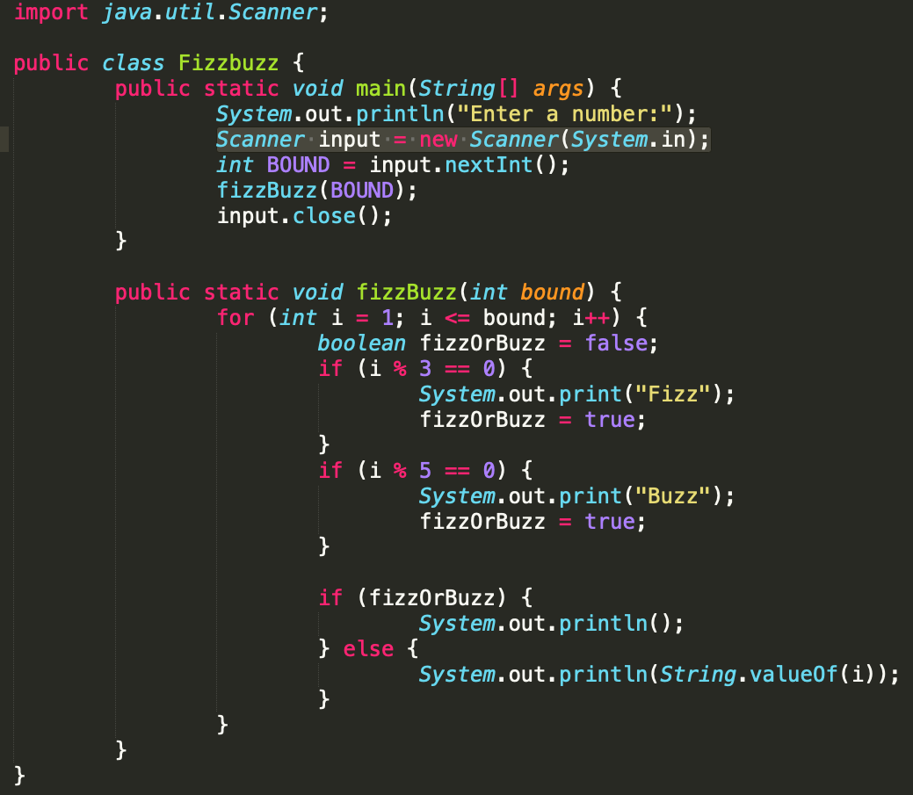
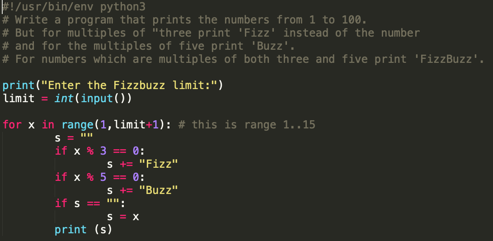

# languages
Comparison of some first year teaching languages for beginners. How do we get **engagement**, how do we get competence in **computational thinking** (some basic algorthms and data structures)?

* Javascript
* Python 
* Java

## Javascript

The web page should look as follows:

Javascript embedded in the HTML scaffolding ([source](javascript/fizzbuzz.html)) would looksomething like:

Students have to learn html, css and Javascript just to write procedural programs. The HTML scaffolding gets in the way of the procedural learning. Flashy webapps have more to do with colorful buttons and forms rather than writing loops (algorithmic thinking). 

We could use **nano** (JS at the server end) to write and test pure Javascript code free of its scaffolding, but then we would lose student engagement (flashy web apps). We might then consider simpler languages such as Python. 

In the webapp mode, it is also relatively dificult for students to write unit tests (see Qunit, for example). Debuggers in browsers are also fairly hard to master.

## Java

A Java version of Fizzbuzz ([source](Java/Fizzbuzz.java))  might look as follows:

Although we do not have the distraction of HTML scaffolding, we do need to inform beginning students to ignore kewords such as **static** and **void**, and OO concepts such as `Scanner input = new Scanner(System.in);` just to get input.

IDE's such as Eclipse are available and support unit tests, but there is a learning curve and Unit testing requires some knowledge of OO. 

Static typing is a plus for student comprehension of computation.

**Object Oriented thinking** and **Procedural thinking** are intertwined in Java and cause confussion for beginners.

## Python

A Python version of Fizzbuzz ([source](Python/fizzbuzz.py))  might look as follows:

Relatively simple IDE's such as VS Code support debugging. There is no HTLM scaffolding, or the distraction of OO. Thus beginning students can focus on the computational core.

